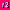

|  | <h1 style="margin: 0;">renderer 2d</h1> |
|:-----------------------------------------------:|:---------------------------------------------------:|

r2 is a minimal and **super easy-to-use** C99 compatiable 2D opengl renderer. It supports texture rendering, framebuffers, SDF text rendering, shape rendering, shader manipulation and more under a simple to use interface.

Example code can be found in the `demo/` folder which shows a lot of functionality.

Note that r2 only supports QOI image loading, but nothing is stopping you from loading your own texture data into `r2_tex`

This project is licensed under Apache License Version 2.0, view LICENSE file for more details.

# Dependencies
 - freetype
 - glad (included in project)
 - stb_truetype (included in project)
 - qoi (included in project)
 - SDL2 (only for demo project)

# Building
```
$ mkdir build && cd build
$ cmake ..
$ make # or whatever command you usually use to build cmake projects
```